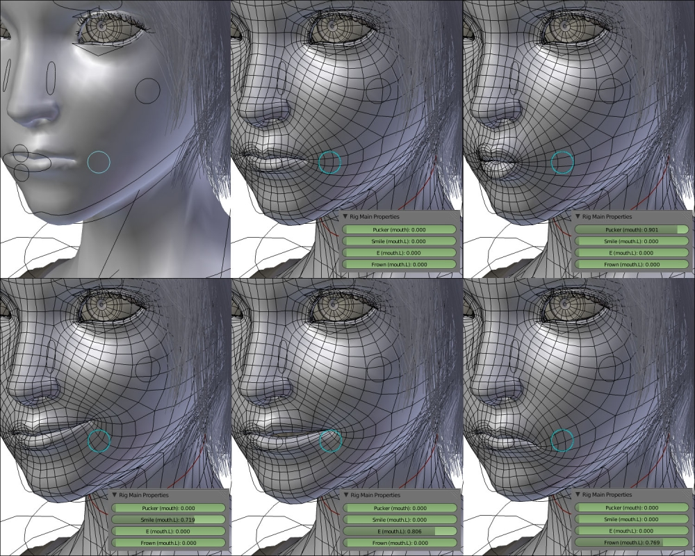

## Two different kinds: **Morph**

 <!-- .element height="450" -->

[~Morph Example~](..)


## Two different kinds: **Rigged**

 <!-- .element height="450" -->

[~Skeleton Example~](..)


## When to use **which**?

- **Rigged**: Most used for **bigger** animations:
  - Walking, dancing, complex animations
  - Combine with motion capture
  
- **Morph**:  Small, detailled animations
  - Smiling, facial expressions

*~Can be used **together**, at the **same time**~*


## How to use with **Three.js**

1. Usually **animate** in 3rd party tool.
2. **Load** the model and animations.
3. Create a `THREE.AnimationMixer` as container
4. Get the `THREE.AnimaionClip` from the model
5. Create a `THREE.ClipAction`s to control clips


## And now with **code**

```
 var loader = new THREE.JSONLoader();
  loader.load('../../assets/models/hand/hand-8.json', function (result) {

    var mesh = new THREE.SkinnedMesh(result, new THREE.MeshNormalMaterial({skinning: true}));
    scene.add(mesh);

    // setup the mixer
    var mixer = new THREE.AnimationMixer( mesh );

    // get the loaded animation
    var animationClip = mesh.geometry.animations[0];

    // create a clipAction from the animation
    mixer.clipAction( animationClip ).play();    
  });
```

## Easy to use **external** models

1. Use blender to check / fix models.
2. Export in three.js supported format
3. Load in show in Three.js

```
  loadModel().then(model => {
    ...
  });

  function loadModel() {
    var loader = new THREE.OBJLoader();
    var p = new Promise(function(resolve) {
        loader.load('../assets/fox/fox.obj', function (obj) {
          resolve(obj);
        });
    });
  
    return p;
  }
```


## Workflow **1**

 <!-- .element height="450" -->


## Workflow **2**

- Try and limit number of vertices
- Scale down textures
- Bake additional textures:
  - lightmap
  - ambient occlusion map
  - normal maps


## Workflow **3**

```
 var loader = new THREE.OBJLoader();
            loader.load("../resources/R2D2_Standing.obj", 
                 function(model) {
  ...
  // 1. scale and position
  // 2. possibly fix some material properties
  ...
  scene.add(model);
 }             
```

[~starwars in Three.js~](../examples/sw/html)


## **Porsche** example

 <!-- .element height="450" -->

[Porsche - WebGL](http://www.porsche.tw/microsite/911/pap.aspx#showroom/911-carrera-4s/2/4/0/0/0)

(show: lightshape, normalmaps, shadowmaps and diffuse maps)

## Some other examples
 - http://www.acsl.co.jp/special.php
 - http://hands.wtf/

