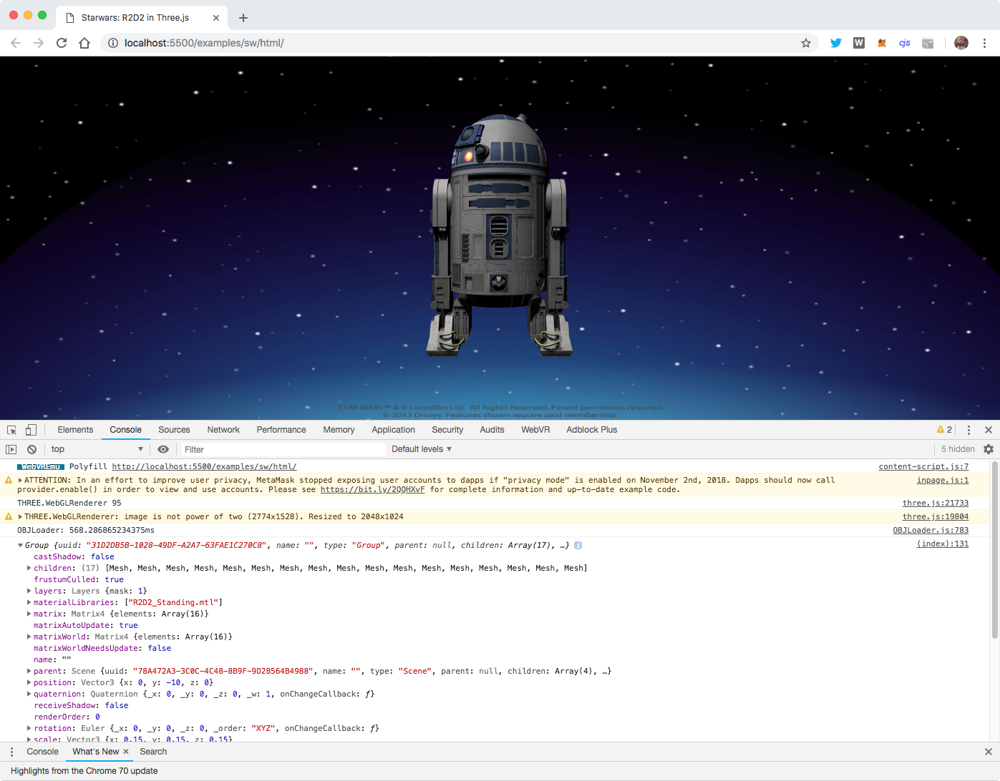
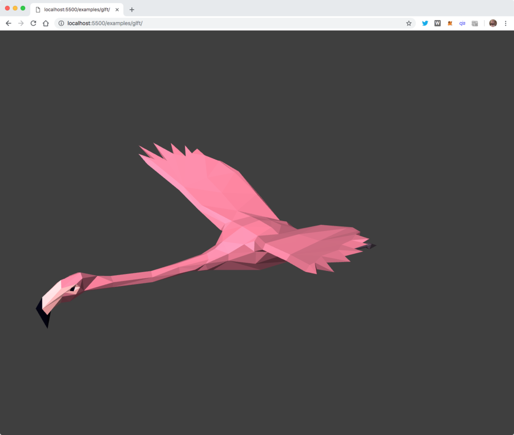
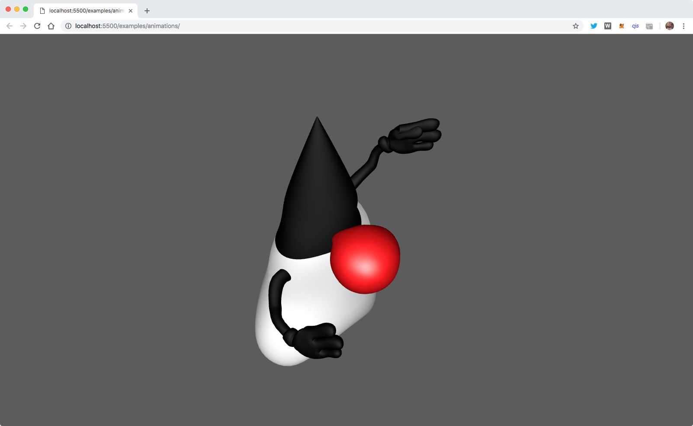

## **Modelling** and **animations**:
  - Three.js provides building blocks and **editor**
    - https://threejs.org/editor/
  - Real modelling and animations:
    - **Blender**, 3dsMax, Cinema 4D, Maya and more...
  - ... but can **import** the resulting **models**


## Basic setup

```javascript
 // or FBXLoader, JSONLoader, ???Loader
 var loader = new THREE.OBJLoader();
            loader.load("../resources/R2D2_Standing.obj", 
            onError, onProgress
            function(model) {
  ...
  // 1. Change scale and position
  // 2. Possibly fix some material properties
  // 3. Connect the animations
  ...
  scene.add(model);
 }             
```

*~ logging to **console** first time ~*


## Loading model **debugging**

 <!-- .element height="450" -->

[~starwars in Three.js~](../examples/sw/html)


## Configuring **animations**

 <!-- .element height="450" -->

[~Flying flamingo~](../examples/gltf)


## Required **code**

```javascript
  var mixer;
  var loader = new THREE.GLTFLoader();
  loader.load( 'flamingo.gltf', function ( gltf ) {
    var mesh = gltf.scene.children[ 0 ];
    mesh.scale.set( 0.35, 0.35, 0.35);
    mesh.position.y = 0;
    scene.add( mesh );
    mixer = new THREE.AnimationMixer( mesh );
    var action = mixer.clipAction(gltf.animations[0])
    action.play();
  });
```
*~the **action** controls the animation~*


## ..and in the **Render** loop

```javascript
  var clock = new THREE.Clock();
  renderer.setAnimationLoop(render)
  
  function render() {
    renderer.render(scene, camera);
    if (mixer) mixer.update(clock.getDelta());
  }
```

*~the **mixer** control the timings~*


## Two different kinds: **Rigged**

 <!-- .element height="300" -->

- Flexible and great for game characters
- **Rotational** movement allowed
- Good on GPU


## Two different kinds: **Morph**

 <!-- .element height="300" -->

- **Full** control 
- limited to **linear** movement
- Bigger models and harder on CPU/GPU


## a **rigged** animation..

 <!-- .element height="450" -->

[~Dancing duke~](../examples/animations)
