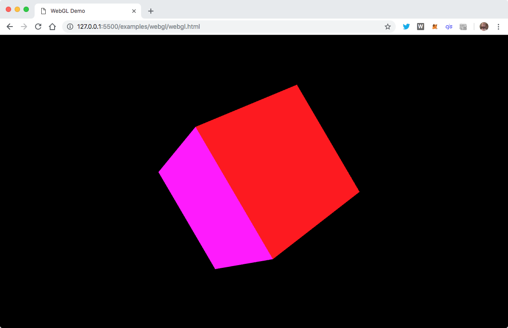
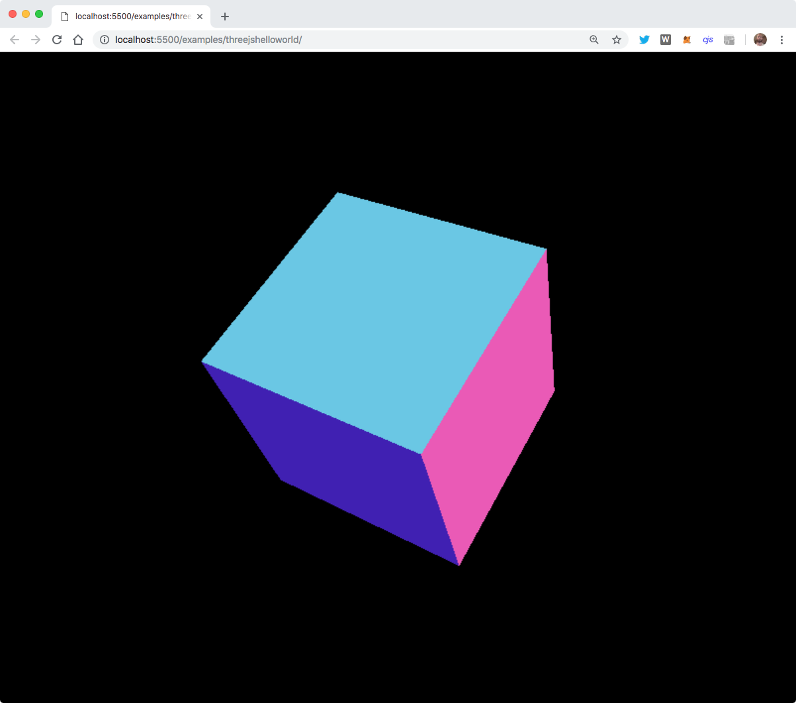

## 3D **Core** concepts

* **Vertex**: point in the 3D world: `(x, y, z)`
* **Line / edge** : connects two points together
* **Face**: three lines connected
* **Geometry**: a collection of faces
* **Surface**: how should the geometry be rendered
* **Mesh / Model**: A geometry and a surface together

## 3D **Core** concepts

 <!-- .element height="50%" width="60%" -->

[~Three.js - 101 Example~](../examples/core-concepts/concepts.html)

## Using **WebGL** directly

 <!-- .element height="50%" width="70%" -->

[~Helloworld of WebGL~](../examples/webgl/webgl.html)

## Using **WebGL** directly

- Create **vertex** and **fragment** shaders
- Pass information from javascript
- Do lots of **linear algebra** and **matrix calculations**
- Learn how to simulate lights, reflections etc.
- ... and a lot of other difficult things

*~ This is what **Three.js** makes easy ~*

## Three.js: Helloworld

 <!-- .element height="450" -->

[~Helloworld of Three.js~](../examples/threejshelloworld)

## Three.js: Helloworld

 <!-- .element height="50%" width="70%" -->

Great API docs: [https://threejs.org/docs](https://threejs.org/docs)
