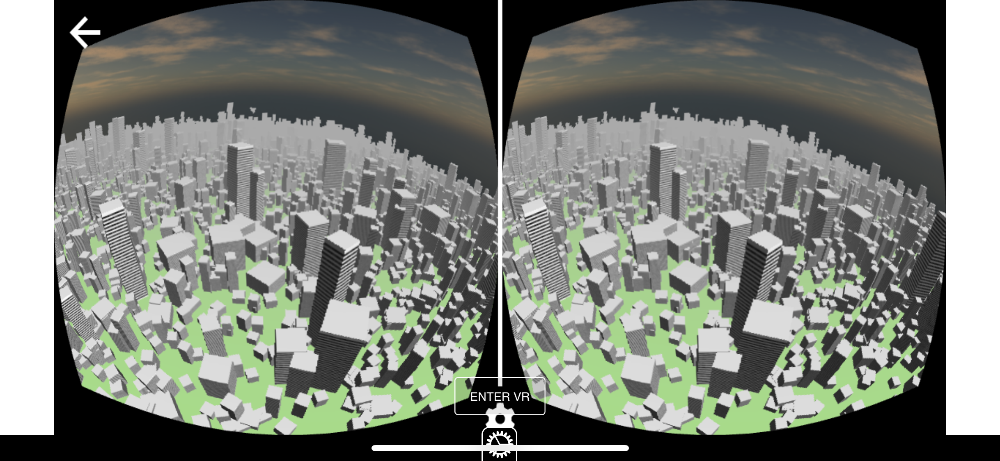

## **VR** part of Web-XR

- Open standard that allows VR in browsers
- Together with AR part of the WebXR standard
- Spec: https://github.com/immersive-web/webxr
- More info: https://webvr.info/


## **API** Support

 <!-- .element height="50%" width="70%" -->

*Great on **desktop**, and on **android**...*


## What does it **provide**

- Detects any available VR devices
  - **Displays** and **controllers**
- Returns information about capabilities
- Handle framerates
- Poll devices on **position** and **orientation**

*Works with **Vive**, **Oculus Rift**, but also with **Google Cardboard***


## How do you **use** it

(from Wikipedia)

 <!-- .element height="50%" width="70%" -->

*.. sounds like lots of work*


## So let's add **VR!** using Three.js

 <!-- .element height="50%" width="70%" -->

[~VR-Less example~](../examples/webvr)


## And convert it to **this**

 <!-- .element height="50%" width="70%" -->

*This shows **Cardboard**, but works same with other **devices***

[~VR-example~](../examples/webvr)


## Easy to add **VR** with **Three.js**

```
// in the HTML
<script src="../libs/three/WebVR.js"></script>

...

// The only Three.js specific item
renderer.vr.enabled = true;

// add a button to switch to VR
document.body.appendChild( WEBVR.createButton( renderer ) );
```


## **Three.js**: Rollercoaster

 <!-- .element height="50%" width="70%" -->

[~RollerCoaster~](https://threejs.org/examples/webvr_rollercoaster.html)